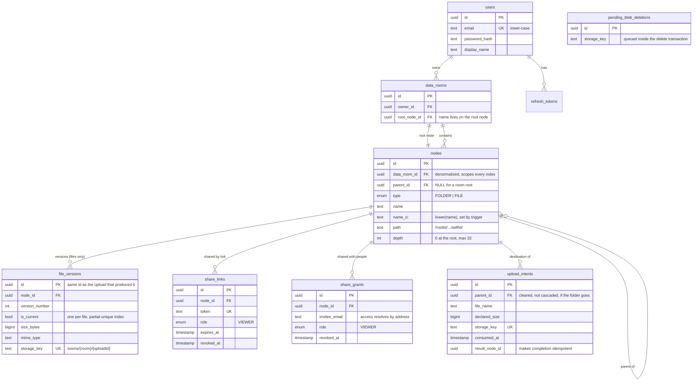

# Data Room — API

The backend of a virtual data room: an organised, private repository for the documents that
change hands during due diligence. Folders nest, files upload straight to object storage, and
any of the three — a room, a folder, a single file — can be shared read-only with a link or
with named people.

NestJS, Prisma, PostgreSQL and S3. This README covers the API: how it is run, the decisions
behind the data model and the access rules, and how each of them was verified.

Related repositories, each documented on its own: the interface in
[dataroom-web](https://github.com/GrandMasterX/dataroom-web) and the AWS infrastructure in
[dataroom-infra](https://github.com/GrandMasterX/dataroom-infra).

---

## Live instance

| | |
| --- | --- |
| **App** | **https://dataroom-web-rosy.vercel.app** |
| **API** | https://api-production-ee652.up.railway.app — the OpenAPI document the frontend is built against is browsable at [`/api/docs`](https://api-production-ee652.up.railway.app/api/docs) |

Two demo accounts, password `Password123!` for both. The sign-in page also has a **Use the
demo account** button, so nothing needs typing.

| Account | What it is there to show |
| --- | --- |
| `owner@demo.dataroom` | Owns the "Acme Acquisition" room: the whole tree, uploads with progress, sharing controls, version history. |
| `viewer@demo.dataroom` | The receiving end of a per-person grant — read-only, and only the "02 Financials" folder. |

And a **public link**, which needs no account at all and is the fastest thing to try:
[**/s/5907cbe5bd994de08fba2e5d0cdd6dc4**](https://dataroom-web-rosy.vercel.app/s/5907cbe5bd994de08fba2e5d0cdd6dc4).
It shares one folder, "03 Legal". Everything above that folder answers 404 to this link — the
room itself included — and the breadcrumbs start at the shared folder instead of revealing the
path to it.

> **The first request after the database has been idle is slower, and that is the free tier
> rather than the code.** Neon suspends the database compute after a few minutes of
> inactivity. Measured end to end against the deployed API: **0.86 s** for the first request
> against **0.27 s** once warm — so roughly six tenths of a second of wake-up, once. The API
> container itself does not sleep, so this is the only cold start there is. Nothing pings the
> stack to hide it.

Where it runs, and why the pieces sit where they do: the API in Amsterdam (Railway `ams`), the
database in Frankfurt (Neon `aws-eu-central-1`), the bucket in Ireland (AWS `eu-west-1`). The
API talks to the database on every request, so those two being close matters most; file bytes
go between the browser and the bucket directly and never pass through the API at all.

---

## Running it locally

Requires Docker, Node 22 and pnpm. Nothing else — no AWS account, no cloud services: the
local stack stands in for both, with MinIO speaking the same S3 API.

```bash
pnpm install
cp .env.example .env          # works as-is against the local stack
docker compose up -d          # PostgreSQL 18 and MinIO, plus the bucket
pnpm db:migrate               # schema, triggers, constraints, indexes
pnpm db:seed                  # two accounts, a data room with documents, both share modes
pnpm start:dev                # http://localhost:4000 — API docs at /api/docs
```

The seed prints the credentials it created: one owner, one invited viewer, a nested folder
structure with real PDFs, one active public link and one per-person grant, so both sharing
modes are exercisable immediately.

That is enough to use the whole API from `/api/docs`. To drive it through the interface as
well, run [dataroom-web](https://github.com/GrandMasterX/dataroom-web) alongside it — its
README covers that side.

Useful commands:

```bash
pnpm test          # unit tests: path arithmetic, name resolution
pnpm test:int      # integration tests against the real PostgreSQL and MinIO
pnpm db:verify     # audits the tree invariants on a live database
pnpm gc:orphans    # deletes storage objects no row refers to
pnpm openapi:emit  # regenerates openapi.json, the contract the frontend builds against
```

---

## Design decisions

### One table for folders and files

Sharing targets "a data room, a folder, or a file". With a single `nodes` table forming a
tree, a share is one `node_id` foreign key rather than three nullable columns, and
breadcrumbs, move, delete and subtree totals have one implementation instead of two. A data
room's root is an ordinary node with no parent, so *share a data room* runs the same code as
*share a folder*.

The room's name is its root node's name. There is deliberately no `data_rooms.name`: two
columns holding one fact drift apart, and renaming a room would become a second code path
next to renaming a folder.

### `parent_id` is the truth; `path` is an index

Each node stores a materialized path (`/rootId/…/selfId/`) alongside its parent reference.
The path makes subtree totals, deletes and moves single-statement operations.

But the guest access boundary is computed from `parent_id` through a recursive query, **not**
from the path. Naming the asymmetry is the point: while a derived column decides who may read
what, a bug in maintaining it is privilege escalation; when real edges decide, the same bug is
a display defect. The recursive walk costs one indexed query bounded by the depth limit.

### The database enforces what it can

Rules that can be constraints are constraints, because application checks run only for the
caller who remembered them and lose every race:

- case-insensitive name uniqueness per folder — a unique index on `(parent_id, name_ci)`
- `name_ci` computed by a trigger, never by the application (see below)
- CHECKs pinning the path's shape and the depth limit
- partial unique indexes: one root per room, one current version per file, one active link
  per node
- `ON DELETE CASCADE` on the tree, so deleting a folder cannot leave orphans

`pnpm db:verify` audits the invariants that cannot be constraints — path against parent,
depth against path, contiguous version numbers — and also checks that the hand-written
database objects still exist, because a generated migration will happily propose dropping
what `schema.prisma` cannot express.

### Case-insensitive names are folded by PostgreSQL, not JavaScript

`lower()` and `toLowerCase()` disagree. Uploading `İSTANBUL.pdf` yields `istanbul.pdf` in
PostgreSQL and `i̇stanbul.pdf` (i + combining dot) in JavaScript. If the application computed
the column, that mismatch would surface as a 500 on a legitimate filename, so a trigger owns
it and every comparison goes through `lower()` in SQL.

### Name conflicts, and why the obvious approach does not work

Inserting, catching the unique violation and retrying with a suffix does not work inside a
transaction: the first violation aborts it, every later statement fails with *current
transaction is aborted*, and nothing commits. Names are allocated with
`INSERT … ON CONFLICT DO NOTHING RETURNING`, which raises nothing and needs no lock — so a
twenty-file drag-and-drop does not serialise.

Rename and move cannot use that form, because an `UPDATE` that violates a unique index has no
upsert equivalent. They take a per-room advisory lock and pick a free name first. Move needs
that lock regardless: without it, "move A into B" and "move B into A" can both pass validation
and produce a detached cycle.

Suffixes are only ever appended. `Report (2024).pdf` becomes `Report (2024) (2).pdf`, never
`Report (2025).pdf` — reading existing parentheses as a counter would silently change what a
document claims to be.

### Uploads go straight to storage

The browser presigns a batch, PUTs each file directly to S3, then asks the API to register
it. Bytes never pass through the API, so upload throughput does not depend on it and a 50 MB
transfer never occupies a request handler.

An `upload_intents` row records what was signed. It does three jobs: completion verifies that
the object that landed is the object that was promised (the client is not trusted about its
own size), garbage collection gets an exact list of unfinished uploads instead of a bucket
scan, and a retried completion returns the same result rather than a conflict.

Two details worth knowing:

- **Content type is signed only if you ask.** Passing `ContentType` to the presign command is
  not enough — the resulting URL carries `X-Amz-SignedHeaders=host` and any content type is
  accepted. `signableHeaders: new Set(['content-type'])` binds it, which is what this code
  does.
- **Size cannot be signed.** `ContentLength` is deliberately unsigned, so the limit is
  enforced after the fact with a `HEAD`, and an oversized object is queued for deletion. That
  is a real limitation, not a claim of enforcement.

### Deleting queues the objects first

Storage keys for every version in the subtree are written to a queue **inside** the
transaction that removes the rows; the objects are deleted after it commits. If the process
died in between, the keys would otherwise be unrecoverable — the version rows are gone — and a
document the user deleted would stay in the bucket. For a due-diligence product that is the
worse of the two failure directions.

### Not found, not forbidden

Reading something you may not see returns **404**. A 403 confirms that a resource exists, and
in this product that alone tells an outsider a deal is under way. 403 is reserved for "you may
read this but not change it", where existence is already known.

The same reasoning shapes what a guest receives: one projection trims every read they can
reach, so the shared node reports no parent, the trail starts at the share, a public link
names only the shared item rather than its data room, and version history — which names the
employees who uploaded each version — stays with the owner.

### Sessions

Passwords are hashed with argon2id (OWASP profile). Sign-in verifies against a dummy hash when
the address is unknown, so a missing account and a wrong password are indistinguishable in
both timing and response; otherwise the endpoint doubles as an "is this person a customer"
oracle, which for a data room leaks who is involved in a deal.

Refresh tokens are opaque, stored only as SHA-256, and rotate on use. Reuse of an already
rotated token revokes every session for that user — with one deliberate exception. Several
browser tabs refetching at once all present the same token, and a strict rule would sign
people out for using the app normally, so a short grace window treats that as one rotation.
Revocation by sign-out is a different event and is never forgiven; the two are told apart by
whether the token was replaced.

The browser never calls this API directly. The frontend proxies requests and keeps tokens in
first-party httpOnly cookies, which removes cross-site cookie handling entirely and puts the
session out of reach of any script on the page.

### Rate limiting counts email addresses, not callers

Because every request arrives through that proxy, the API sees one source address for all
users. An IP-keyed limit would throttle the entire user base together while an attacker
spreading guesses across accounts stayed under it, so credential attempts are counted per
email address.

---

## Data model



Object keys contain no user-supplied text — `rooms/{dataRoomId}/{uploadIntentId}` — which
makes path traversal and unicode collisions structurally impossible, turns renaming into a
metadata-only change, and means a new version never overwrites previous bytes.

---

## How it scales

### Computing a folder's total size and item count

One range scan over the materialized path:

```sql
SELECT count(*) FILTER (WHERE n.type = 'FOLDER') AS folders,
       count(*) FILTER (WHERE n.type = 'FILE')   AS files,
       coalesce(sum(v.size_bytes), 0)            AS bytes
FROM nodes n
LEFT JOIN file_versions v ON v.node_id = n.id AND v.is_current
WHERE n.data_room_id = $1 AND n.path LIKE $2 || '%' AND n.id <> $3;
```

served by `(data_room_id, path text_pattern_ops)`. Always exact, nothing to invalidate.

Two things that were verified rather than assumed, because both silently degrade to a
sequential scan:

- the prefix must be a **bound parameter** — PostgreSQL derives the index range from a value
  but not from a pattern built inside a subquery;
- it must stay a `LIKE`. Rewriting it as `path >= $1 AND path < $2` looks more explicit and is
  slower: a `text_pattern_ops` index implements the `~>=~` family, not collation-aware `>=`.

The reported size is the **logical** one — current versions only — while deleting removes
every version, so the delete dialog says "including N previous versions" rather than quoting a
number that does not match what disappears.

At a size where this scan is too slow, the shape of the fix is a `folder_rollups` table
updated incrementally: the ancestor ids are already in `path`, so it is
`UPDATE … WHERE folder_id = ANY($1)` from a trigger or a worker. The exact query above stays
as the correctness reference. The trade-off is explicit — exact on read versus cheap on read
and eventually consistent.

### One data room with 100,000 files

Listing is already independent of room size: it is scoped by `parent_id` and paginated by
keyset over `(type, name_ci, id)` with an index in exactly that order, so a page is an index
seek with no sort step. `OFFSET` is not used anywhere — it reads and discards every skipped
row, and under concurrent inserts it skips or repeats rows across pages.

Verified on a 100,000-node room:

| Query | Plan |
| --- | --- |
| Keyset page of a folder | `Index Scan` on the composite index, no `Sort` node |
| Filename search | `Bitmap Index Scan` on the trigram GIN index, chosen by the planner |
| Subtree totals | `Bitmap Index Scan` on the path index with derived `~>=~` bounds |

What would change beyond that: the totals move to rollups; deleting a very large subtree
becomes "mark, then drain in the background" (which is where a soft delete finally earns its
place — this MVP deliberately does not have one); the frontend virtualises long lists rather
than paging by button; and searches shorter than three characters stay rejected, since they
produce no complete trigrams and would scan the room on every keystroke.

Two things already scale by construction: uploads never pass through the API, and garbage
collection reads database rows rather than listing the bucket, so its cost does not grow with
stored data — which is also why the application's IAM policy does not include `s3:ListBucket`.

### Extending sharing to per-user roles

Both share tables already carry a `role`, and every permission question goes through one
matrix in `src/access/permissions.ts`. Adding EDITOR is a value in the `ShareRole` enum and a
row in that matrix — no table changes, no endpoint changes. The interface needs nothing
either: responses already carry capability flags computed from the same matrix, so a client
renders whatever the new role permits without knowing the rule.

Two decisions make that possible now rather than later. Overlapping shares resolve to the most
permissive role, so nothing has to be invented when a second role exists. And organisation-wide
roles ("everyone at this domain may view") slot in as another source of grants behind the same
resolver, because access resolution already collects applicable shares before deciding.

---

## Testing

15 unit tests and 71 integration tests. The integration suite runs against real PostgreSQL and
real MinIO from the same `docker-compose.yml` developers use, because roughly half of what it
checks is a property of those systems — a partial index, `ON CONFLICT` semantics, presigned
URL signing — and a mocked client can only confirm what the author already believed.

Every test names the mutation that must turn it red, and those mutations were applied. A few
that found something:

- dropping the `name_ci` trigger turns two tests red;
- changing the subtree rewrite offset by one turns the literal-path assertions red;
- removing the cycle check makes a folder movable into its own descendant;
- scoping search by data room instead of by subtree lets a guest find documents outside their
  share;
- keying the rate limiter by IP instead of by email address locks out unrelated accounts.

One test was rewritten because the mutation *did not* turn it red: the rate-limit test compared
two different endpoints, and the limiter's key includes the handler, so it would have passed
under the broken implementation too.

**An intermittent failure, and what it turned out to be.** For a while a different
integration test would fail on roughly one full run in four, always with something like
`expected 201 "Created", got 404 "Not Found"`, and never when its own suite ran alone. Nothing
in the request path can answer 404 there — the guard answers 401 and the service throws no
not-found — so the endpoint was never a plausible culprit.

Two things made it findable. Running the suite next to a heavy build reproduced it on demand,
where an idle machine had hidden it for forty-six consecutive runs. And once reproducible, a
failure finally surfaced as `read ECONNRESET`, which named the layer: transport, not domain.

The cause was in the harness. It called `app.init()` but never `listen`, and Supertest binds a
server itself when handed one that is not listening — per request, then tears it down.
Thousands of ephemeral ports opened and closed in a few seconds is fine until the machine is
busy, at which point requests start landing on a socket that is going away. `app.listen(0)`
once per suite fixed it: ten runs under the same load, all green, and putting `app.init()`
back brought the same 404 straight back.

Worth recording because the obvious response — retrying the flaky test — would have buried a
real defect in the test harness under a green tick.

---

## Deliberately not built

Trash and restore, "request access" on a closed link, an EDITOR role in the interface,
document comments, an audit log of views, email delivery for invitations (the owner copies an
invite link instead), previews for formats other than PDF, deduplication by checksum, and
multipart uploads for files above 5 GB.

Each is a real feature, and none is half-present in the interface: the product shows only what
works.

---

## Where AI was used

This project was built with Claude Code, and the useful summary is not "AI wrote it" but which
parts benefited and which needed pushing back on.

**What it did well.** Scaffolding and mechanical work — modules, DTOs, controllers,
migrations — went quickly. Reviewing its own plan adversarially was productive: a review pass
before any code existed found that the schema sketch declared no relations at all, which would
have produced a database with no foreign keys and a delete that silently orphaned subtrees.

**Where it was wrong, and how that was caught.** Several confident claims turned out to be
false and were only caught by running things:

- "Passing `ContentType` to the presigner signs it" — inspecting a signed URL showed
  `X-Amz-SignedHeaders=host`, and four different content types were accepted against one
  signature. The plan and the code comment were corrected.
- "Catch the unique violation and retry" — a transaction probe showed the first violation
  aborts the whole transaction; the mechanism was replaced.
- "The alpine Postgres image initialises with the C locale" — it does not, but the underlying
  concern was real for a different reason, found by testing actual inputs.
- "Unescaped user text in a LIKE pattern is only a correctness issue" — half right. Probing
  the deployed search with `%%%` returned every name in the room; probing it again with a
  share token confirmed the access boundary held, which is what turned a suspected leak into
  a bug with a known blast radius. Both the fix and a test pinning either direction followed.

The working method that produced those corrections: verify by execution rather than by
reading, and prove a test fails when the code is broken before trusting it. Both are why the
notes above can say what is verified and what is merely assumed.

**Project-specific instructions.** The repository carries its own agent instructions under
`.claude/skills/` — the tree and access invariants, API conventions, the PostgreSQL and S3
rules learned here. They exist so that a later session, human or otherwise, does not
rediscover the same traps.
